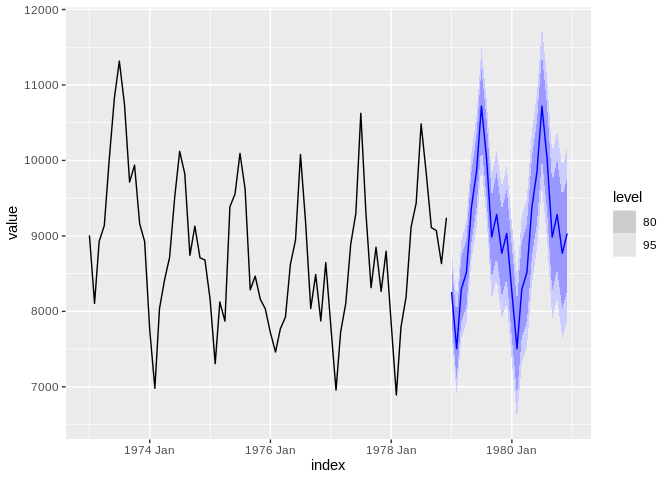
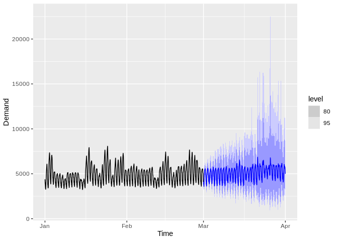

<!-- README.md is generated from README.Rmd. Please edit that file -->

fasster 
=======================================================

[](https://github.com/tidyverts/fasster)
[](https://www.tidyverse.org/lifecycle/#experimental)
[](https://codecov.io/github/tidyverts/fasster?branch=master)
<!-- [](https://cran.r-project.org/package=fasster) -->
<!-- [](https://cran.r-project.org/package=fasster) -->

An implementation of the FASSTER (Forecasting with Additive Switching of
Seasonality, Trend and Exogenous Regressors) model in R. This model is
designed to capture patterns of multiple seasonality in a state space
framework by using state switching. The *fasster* package prioritizes
flexibility, computational speed and accuracy to provide convenient
tools for modelling, predicting and understanding high frequency
time-series.

Development cycle
-----------------

This package is early in development, and there are plans to make
substantial changes in the future.

The latest usage examples of using fasster can be found in my useR! 2018
talk: [slides](https://slides.mitchelloharawild.com/user2018/#1),
[video](https://www.youtube.com/watch?v=6YlboftSalY),
[source](https://github.com/mitchelloharawild/fasster_user2018).

There are further plans to improve the heuristic optimisation techniques
and better use sparse matrix algebra (removing the dlm package
dependency) to make fasster even faster. Implementing this will likely
result in a revision of the model object structure, but user directed
functionality should remain the same.

Installation
------------

<!-- The **stable** version can be installed from CRAN: -->
<!-- ```{r, eval = FALSE} -->
<!-- install.packages("fasster") -->
<!-- ``` -->
The **development** version can be installed from GitHub using:

``` r
# install.packages("devtools")
devtools::install_github("tidyverts/fasster")
```

Usage
-----

### Model specification

*fasster* allows flexible model specification by allowing the user to
specify the model structure with standard formula conventions.

``` r
library(fasster)
library(tidyverse)
library(lubridate)
library(tsibble)
library(fable)

lung_deaths <- as_tsibble(cbind(mdeaths, fdeaths), pivot_longer = FALSE)
fit <- lung_deaths %>%
  model(fasster = FASSTER(fdeaths ~ mdeaths))
fit %>% report()
#> Series: fdeaths 
#> Model: FASSTER 
#> 
#> Estimated variances:
#>  State noise variances (W):
#>   mdeaths
#>    1.7119e-34
#> 
#>  Observation noise variance (V):
#>   1.6631e+03
```

Commonly used state space components can be added using the following
convenience functions:

-   `trend(n)` to include an n-th order polynomial
-   `season(s)` to include a seasonal factor of frequency s
-   `fourier(s, q)` to include seasonal fourier terms of frequency s
    with q harmonics
-   `arma(ar, ma)` to include an ARMA term (where ar and ma are vectors
    of coefficients)
-   Exogenous regressors can be added by referring to their name

For example, to create a model with trend and monthly seasonality, you
can use:

``` r
fit <- as_tsibble(USAccDeaths) %>% 
  model(fasster = FASSTER(value ~ trend(1) + fourier(12)))
fit %>% report()
#> Series: value 
#> Model: FASSTER 
#> 
#> Estimated variances:
#>  State noise variances (W):
#>   fourier(12)
#>    6.6663e-13 7.5474e-13 3.6532e-13 3.6933e-13 3.3369e-13 2.8588e-13 4.2485e-13 2.2424e-13 3.2003e-13 2.1307e-13 1.8887e-13
#>   trend(1)
#>    5.9382e+03
#> 
#>  Observation noise variance (V):
#>   2.0543e+04
```

The interface for creating a FASSTER model introduces a new formula
construct, `%S%`, known as the switch operator. This allows modelling of
more complex patterns such as multiple seasonality by modelling the
components for each group separately and switching between them.

``` r
elec_tr <- tsibbledata::vic_elec %>%
  filter(
    Time < lubridate::ymd("2012-03-01")
  ) %>% 
  mutate(WorkDay = wday(Time) %in% 2:6 & !Holiday)

elec_fit <- elec_tr %>%
  model(
    fasster = fasster(log(Demand) ~ 
      WorkDay %S% (fourier(48, 16) + trend(1)) + Temperature + I(Temperature^2)
    )
  )
```

### Decomposing

Fitted FASSTER models can be decomposed to provide a description of how
the underlying states function. Decomposing a FASSTER model provides
aggregates of its components such as trends and seasonalities.

These components can accessed from a fitted model using the
`components()` function:

``` r
fit %>% 
  components()
#> # A dable:               72 x 5 [1M]
#> # Key:                   .model [1]
#> # FASSTER Decomposition: value = `fourier(12)` + `trend(1)`
#>    .model     index value `fourier(12)` `trend(1)`
#>    <chr>      <mth> <dbl>         <dbl>      <dbl>
#>  1 fasster 1973 Jan  9007        -795.       9740.
#>  2 fasster 1973 Feb  8106       -1546.       9754.
#>  3 fasster 1973 Mar  8928        -758.       9719.
#>  4 fasster 1973 Apr  9137        -536.       9706.
#>  5 fasster 1973 May 10017         322.       9693.
#>  6 fasster 1973 Jun 10826         802.       9694.
#>  7 fasster 1973 Jul 11317        1669.       9830.
#>  8 fasster 1973 Aug 10744         974.       9755.
#>  9 fasster 1973 Sep  9713         -65.7      9761.
#> 10 fasster 1973 Oct  9938         233.       9768.
#> # … with 62 more rows
```

``` r
elec_fit %>%
  components()
#> # A dable:               2,880 x 9 [30m] <Australia/Melbourne>
#> # Key:                   .model [1]
#> # FASSTER Decomposition: log(Demand) = `WorkDay_FALSE/fourier(48, 16)` +
#> #   `WorkDay_FALSE/trend(1)` + `WorkDay_TRUE/fourier(48, 16)` +
#> #   `WorkDay_TRUE/trend(1)` + Temperature + `I(Temperature^2)`
#>    .model Time                `log(Demand)` `WorkDay_FALSE/… `WorkDay_FALSE/…
#>    <chr>  <dttm>                      <dbl>            <dbl>            <dbl>
#>  1 fasst… 2012-01-01 00:00:00          8.39         -0.00345             8.75
#>  2 fasst… 2012-01-01 00:30:00          8.36         -0.0234              8.75
#>  3 fasst… 2012-01-01 01:00:00          8.31         -0.0971              8.75
#>  4 fasst… 2012-01-01 01:30:00          8.26         -0.105               8.76
#>  5 fasst… 2012-01-01 02:00:00          8.30         -0.117               8.76
#>  6 fasst… 2012-01-01 02:30:00          8.26         -0.0812              8.78
#>  7 fasst… 2012-01-01 03:00:00          8.21         -0.251               8.76
#>  8 fasst… 2012-01-01 03:30:00          8.18         -0.144               8.82
#>  9 fasst… 2012-01-01 04:00:00          8.14         -0.374               8.68
#> 10 fasst… 2012-01-01 04:30:00          8.12         -0.202               8.81
#> # … with 2,870 more rows, and 4 more variables: `WorkDay_TRUE/fourier(48,
#> #   16)` <dbl>, `WorkDay_TRUE/trend(1)` <dbl>, Temperature <dbl>,
#> #   `I(Temperature^2)` <dbl>
```

The tools made available by *fasster* are designed to integrate
seamlessly with the tidyverse of packages, enabling familiar data
manipulation and visualisation capabilities.

### Forecasting

*fasster* conforms to the object structure from the *fable* package,
allowing common visualisation and analysis tools to be applied on
FASSTER models.

``` r
fit %>% 
  forecast(h=24) %>%
  autoplot(as_tsibble(USAccDeaths))
```



Future index values are automatically produced and used where necessary
in the model specification. If additional information is required by the
model (such as `WorkDay` and `Temperature`) they must be included in a
`tsibble` of future values passed to `new_data`.

``` r
elec_ts <- tsibbledata::vic_elec %>%
  filter(
    yearmonth(Time) == yearmonth("2012 Mar")
  ) %>% 
  mutate(WorkDay = wday(Time) %in% 2:6 & !Holiday) %>% 
  select(-Demand)
elec_fit %>% 
  forecast(new_data = elec_ts) %>% 
  autoplot(elec_tr)
```



------------------------------------------------------------------------

Please note that this project is released with a [Contributor Code of
Conduct](.github/CODE_OF_CONDUCT.md). By participating in this project
you agree to abide by its terms.
